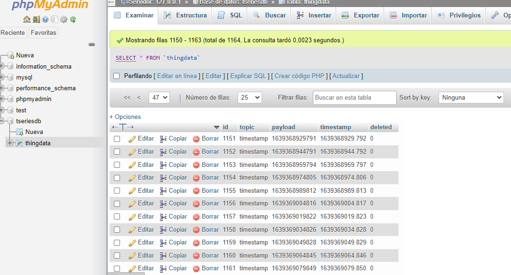
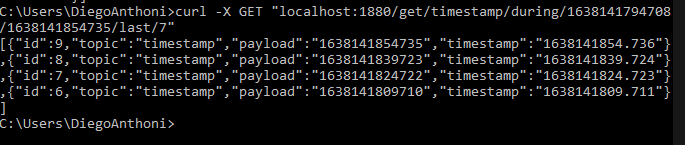
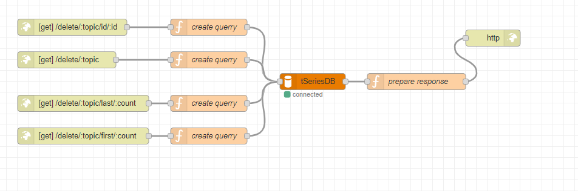
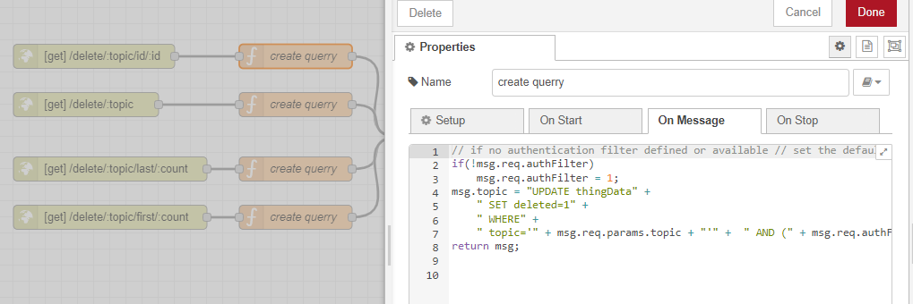
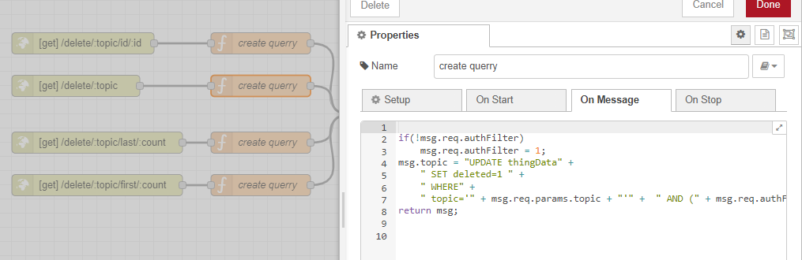
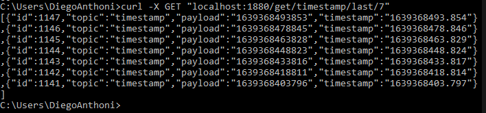
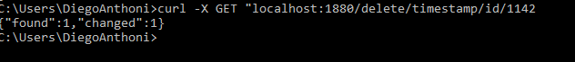
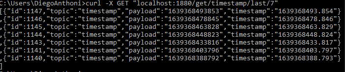
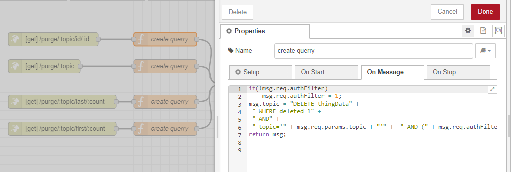

# Practica - Capitulo 9 
 En esta practica se desarrollo el ejercicio propuesto en el Capítulo 9 (Páginas 137 - 152), correspondiente a Data Access API and Data Deletion API del libro Build Your Own IoT Platform.

## Participantes 
- Diego Antony Gutierrez Gutierrez 
## Herramientas 
- [Docker Compose](https://www.docker.com/)
- [Node-Red](https://nodered.org/)
- [Mosquitto](https://mosquitto.org/)

## Ejecutando el proyecto
### Prerequisitos para correr desde docker

- Tener instaldo Mysql
- Tener phpMyAdmin
- Mosquitto 
- Node-Red

#### Importar la base da datos

En nuestro directorio phpMyAdmin importamos el archivos tseriesdb, que esta nuestra base de daots con la cual esta desarrollada esta actividad.

<p align="center"> </p>

- Tabla de nuestra base de datos. 
<p align="center"> </p>

#### Importamos a Node-Red
Ahora vamos importar nuestro json a nuestra plantilla en Node-Red. Nuestro json se encuentra en la carpeta node-red-json.

<p align="center"> </p>


### Distribución de nuestro Json Node-Red

 - En los flows Ejemplo1, Ejemplo2, Ejemplo3, Ejemplo4 estas distribuidos los ejemplos realizados en la actividad del Capitulo7.
 - En los flows Chapter9 - Data Access API y Chapter9 - Data Deletion API.

## Data Acces API 

### Secuencia de API de solicitud de datos basada en condiciones 
 - Implementacion de nuestra API.
    <p align="center"> </p>

 - Utilizaremos Curl para hacer un llamado a nuestra  API  con el comando.

```
    # curl -X GET "localhost:1880/get/topicLike/my*/ payloadLike/*/last/5" 
```
- Esta consulta a nuestra API nos producirá todos los registros que coincidan con nuestros criterios y limitará la salida para el recuento de registros que solicitamos.

    <p align="center"> </p>

```
    # curl -X GET "localhost:1880/get/topicLike/timesta*/payloadLike/*/last/2"
```

<p align="center"> </p>

### Agregando filtros basados en tiempo

- Implementacion de nuestra API. Ahora contaremos con tres nuevos puntos, uno para obtener registros sobre el tema especificado, uno para los registros creados antes de la marca de tiempo especificada y otro para los registros creados entre las dos marcas de tiempo.

<p align="center"> </p>

-  A diferencia del ejemplo anterior esta parte buscaremos  marcas de tiempo con condiciones menores o mayores que un punto establecido.

<p align="center"> </p>

- Las siguientes pruebas basadas en cURL muestran cómo se puede utilizar la API.

```
    # curl -X GET "localhost:1880/get/mytopic/last/7" 

```
<p align="center"> </p>

```
    # curl -X GET "localhost:1880/get/mytopic/before/1638142104.624/last/5"
```
<p align="center"> </p>

```
   # curl -X GET "localhots:1880/get/mytopic/during/1638141794708/168141854735/last/7"

```

<p align="center"> </p>

## API de eliminación de datos

En este ejemplo se busca eliminar datos de nuestra base de datos segun algunas condiciones.

- Implementacion de nuestro API.

<p align="center"> </p>

- Eliminar un dato de acuerdo al ID ingresado.

<p align="center"> </p>

- Eliminar datos masivamente 

<p align="center"> </p>

Las siguientes pruebas basadas en cURL muestran cómo se puede utilizar la API.

- Primero solicitaremos  las 5 ultimas consultas.
```
   # curl -X GET "localhost:1880/get/timestamp/last/7"

```
<p align="center"> </p>

- Seguidamente eliminaremos uno   nuestros datos vistos en el punto anterior utilizando el ID. 

```
   # curl -X GET "localhost:1880/delete/timestamp/id/1142"

```

<p align="center"> </p>

Verificamos

<p align="center"> </p>


- Ahora implementaremos nuestra API para que pueda eliminar los datos completamente de nuestra base de datos.

<p align="center"> </p>

```
   # curl -X GET "localhost:1880/purge/timestamp/id/1145"

```
